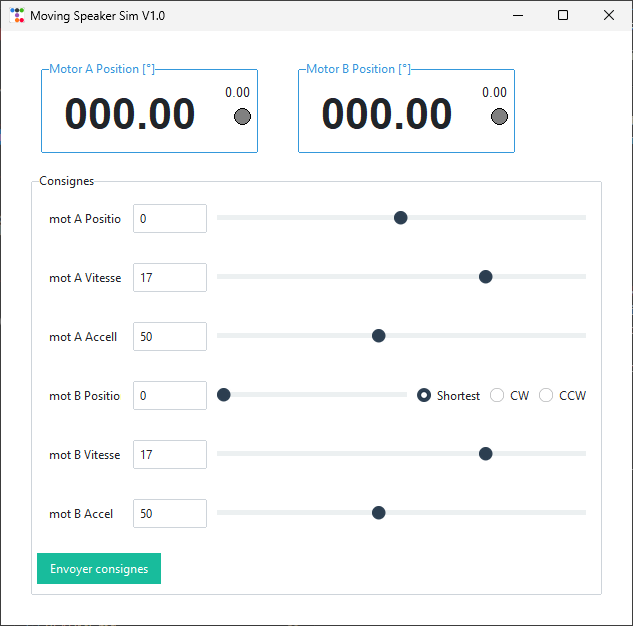

# Moving Speaker Simulator

This folder contains a small GUI simulator used to control and monitor the Moving Speaker project from a PC. The simulator connects to the Arduino firmware over a serial link and provides controls to send setpoints and view motor status.



This README explains how to create a Python virtual environment, install dependencies, and run the simulator on Windows, Linux and macOS. It also documents the command-line options supported by the simulator (`-p/--port` and `-l/--log`).

Requirements
- Python 3.8 or later
- A serial port device (Arduino) or a serial emulator

Dependencies
The required Python packages are listed in `requirements.txt`:
- `ttkbootstrap` (GUI theme toolkit)
- `matplotlib` (if used by additional modules)
- `pyserial` (serial communication)

Prepare a virtual environment and install dependencies

Windows (PowerShell)
```powershell
# from repository root
cd moving_speaker\moving_speaker_sim
# create venv
python -m venv .venv
# activate venv (PowerShell)
.\.venv\Scripts\Activate.ps1
# install requirements
pip install -r requirements.txt
```

Windows (cmd.exe)
```cmd
cd moving_speaker\moving_speaker_sim
python -m venv .venv
.\.venv\Scripts\activate.bat
pip install -r requirements.txt
```

Linux / macOS (bash/zsh)
```bash
cd moving_speaker/moving_speaker_sim
python3 -m venv .venv
source .venv/bin/activate
pip install -r requirements.txt
```

Run the simulator

Basic usage (default COM3):
```powershell
# with virtualenv activated
python moving_speaker_sim.py
```

Specify serial port (example):
- Windows: `COM3`, `COM4`, etc.
- Linux: `/dev/ttyUSB0`, `/dev/ttyACM0`, etc.
- macOS: `/dev/tty.usbserial-XXXX` or similar

Examples:
```powershell
# Use COM4 on Windows
python moving_speaker_sim.py -p COM4

# Use /dev/ttyUSB0 on Linux
python moving_speaker_sim.py -p /dev/ttyUSB0

# Use macOS device
python moving_speaker_sim.py -p /dev/tty.usbserial-FT123
```

Enable logging to file

You can log all sent and received serial frames (timestamped) by supplying the `-l` / `--log` option with a file path. The log file is opened in append mode.

Example (Windows PowerShell):
```powershell
python moving_speaker_sim.py -p COM3 -l C:\temp\serial_log.txt
```

Example (Linux/macOS):
```bash
python moving_speaker_sim.py -p /dev/ttyUSB0 -l /tmp/serial_log.txt
```

Log format (one line per frame):
```
YYYY-MM-DD HH:MM:SS.mmm Serial <- <incoming-frame>
YYYY-MM-DD HH:MM:SS.mmm Serial -> <outgoing-frame>
```

Notes and troubleshooting
- If the GUI does not appear on Linux/macOS, make sure you have a working X11 or Wayland session and that `DISPLAY` is set (or use an X server on Windows).
- If you get a permission error opening a serial device on Linux, add your user to the `dialout` (or relevant) group, or run with elevated privileges:
  - Add user to dialout: `sudo usermod -a -G dialout $USER` (then log out/in)
- On macOS, serial device names can change — list devices with `ls /dev/tty.*`.
- If the simulator cannot open the log file, it prints a warning and continues without logging.

Serial protocol (summary)
- The simulator follows the Arduino firmware protocol documented in the project README. Key points:
  - Baud rate: 115200
  - Send commands as a single CSV line (7 fields) terminated by `\n`.
  - The simulator prints any serial frames that do not start with `P:` to the console and will log frames when `-l` is provided.

Where to go next
- If you want a headless test script to exercise the protocol (send scripted commands without the GUI), I can add a small `tools/send_cmd.py` utility.
- If you want the simulator to accept more CLI options (verbose mode, sample rate, simulated data), tell me which options you want and I will add them.

